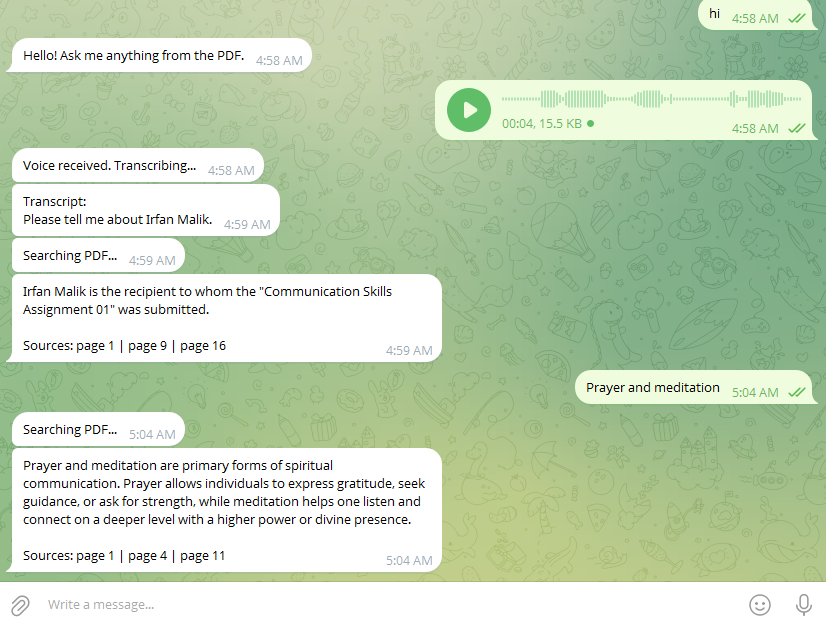

## Overview

This project is a **Telegram-based Voice & Text AI Assistant** powered by Retrieval-Augmented Generation (RAG). It allows users to interact with a PDF knowledge base using **natural language or voice messages**, and receive accurate, context-aware responses in real time.

Instead of generic AI responses, this bot grounds every answer in the uploaded document, making it reliable, focused, and useful for real-world applications.

---

## What It Does

- Accepts **text and voice messages** via Telegram  
- Converts voice → text using AI transcription  
- Searches a **PDF knowledge base** using semantic understanding  
- Generates accurate answers based only on document content  
- Returns **clean, concise responses with source references (page numbers)**  

---

## How It Works

This system follows a structured AI pipeline:

### 1. User Interaction
Users send:
- Text queries  
- Voice notes  

### 2. Voice Processing (if applicable)
Voice messages are:
- Transcribed into text using AI speech recognition  
- Passed into the same query pipeline as text  

### 3. Document Retrieval (RAG)
- The PDF is preprocessed into **semantic chunks**
- Each chunk is converted into vector embeddings
- User queries are matched against these embeddings using similarity search
- Relevant chunks are retrieved using **MMR (Max Marginal Relevance)** for diversity

### 4. Response Generation
- Retrieved context is passed to a language model
- The model generates a **clear, human-readable answer**
- Information from multiple chunks is combined into one response

### 5. Source Attribution
- Instead of dumping raw text, the system outputs:

- - This ensures transparency and trust

---

## Key Features

- 🎤 Voice + Text support  
- 📄 PDF-based knowledge system  
- 🧠 Context-aware answers (no hallucination)  
- 🔍 Semantic search with FAISS  
- 📚 Clean source referencing  
- ⚡ Real-time Telegram interaction  
- 🧩 Modular architecture (easy to extend)  

---

## Why This Project Matters

Most chatbots give **generic answers**.  
This system gives **grounded answers**.

### The difference:
| Traditional Chatbot | This System |
|--------------------|------------|
| Generic knowledge  | Document-specific |
| Can hallucinate    | Grounded in PDF |
| No traceability    | Page-level sources |
| Text only          | Voice + Text |

---

## Real-World Use Cases

- 📚 Educational assistants (notes, assignments, books)  
- 🏢 Company internal knowledge bots  
- 📑 Document Q&A systems  
- ⚖️ Legal or policy document assistants  
- 📦 Product manuals & support bots  

---

## Tech Stack

### Core AI
- **LangChain** – RAG pipeline orchestration  
- **Google Gemini API** – LLM + embeddings + transcription  

### Retrieval System
- **FAISS** – Vector similarity search  
- **MMR Retrieval** – Diverse and relevant chunk selection  

### Backend
- **Python**  
- **python-telegram-bot** – Telegram integration  

### Data Processing
- **PyPDFLoader** – PDF parsing  
- **RecursiveCharacterTextSplitter** – intelligent chunking  

### Infrastructure
- **Render (Background Worker)** – deployment  
- **GitHub** – version control  

---

## Architecture Summary
User (Telegram)
↓
Text / Voice Input
↓
Voice → Text (if needed)
↓
Query Embedding
↓
FAISS Vector Search
↓
Relevant Chunks
↓
LLM (Gemini)
↓
Final Answer + Sources

---

## Highlights

- Designed as a **production-style AI system**, not just a demo  
- Combines **speech AI + RAG + messaging platform**  
- Focused on **accuracy, clarity, and usability**  
- Easily extendable to:
  - multiple documents  
  - databases  
  - APIs  

---

## Final Note

This project demonstrates how modern AI systems move beyond simple chatbots into **intelligent, context-aware assistants** that can interact naturally and provide reliable, traceable answers.
